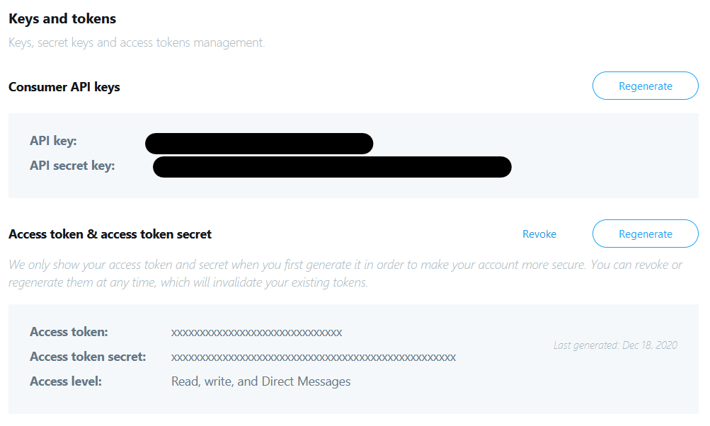

# tweet-sweeper

This is a toy Rust CLI application whose main goal is to turn Twitter into an ephemeral message board platform. `tweet-sweeper` deletes any tweet created before a certain number of days. 

## Requirements

* [Rust toolchain](https://www.rust-lang.org/tools/install)
* A Twitter Developers account and an Application.

## Usage

First, rename the file `template.configuration.toml` to `configuration.toml` and fill-in the placeholders.

**IMPORTANT: This app assumes that the account you want to delete tweets from is the same account used to create the Twitter App in the Twitter Developers Portal.**

```toml
[api.app]
key = "my-twitter-app-key"
secret = "my-twitter-app-secret"

[api.user]
token = "my-twitter-user-token"
token_secret = "my-twitter-user-secret"
display_name = "my-twitter-display-name"

[app]
delete_days = 15
```

Keys are found in the "Keys and tokens" section of your Twitter Application:


Setting `app.delete_days` option will tell `tweet-sweeper` remove all those tweets prior to `delete_days` days from the execution date.

Once configured, just run
```shell
cargo run
```

`tweet-sweeper` uses the [env_logger crate](https://crates.io/crates/env_logger), hence you can enable logs by setting the environment variable `RUST_LOG`. See the `env_logger` documentation for further information.